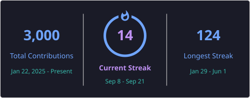

<div align="center">


<a href="https://git.io/typing-svg">
  
</a>

<br/>


<a href="https://github.com/rebira678?tab=followers"></a>

</div>

<br/>

## 👨‍💻 About Me

<table>
<tr>
<td width="60%" valign="top">

Hey, I'm **Rebira** — most people know me as **rebik**. I'm an AI Engineer and full-stack developer who loves building clean, practical web apps and making AI models smarter. Most of my time lives at the intersection of solid backend engineering and intelligent, data-driven systems — I like things that work *and* think.

Outside of shipping code, I spend a lot of time on LLM fine-tuning, evaluation, and alignment work like RLHF, and I keep my problem-solving sharp with 500+ challenges solved across LeetCode and Codeforces.

</td>
<td width="40%" valign="top">

**Quick Facts**

🧠&nbsp;&nbsp;AI Engineer & Full-Stack Dev
🌍&nbsp;&nbsp;Based in Ethiopia
🚧&nbsp;&nbsp;Building **TradeDraft**
📚&nbsp;&nbsp;Learning multi-agent orchestration
🏫&nbsp;&nbsp;A2SVian
🎯&nbsp;&nbsp;500+ DSA problems solved

</td>
</tr>
</table>

### 🚀 What I'm Focused On

- 🧠 **Training & Aligning AI** — fine-tuning, evaluation, and alignment frameworks like RLHF to make sure models deliver high-quality, reliable, safe results.
- 🛠️ **Building TradeDraft** — an AI-powered platform helping solo contractors manage quotes, professional paperwork, and their project lifecycle end to end.
- 🧩 **Solving Hard Problems** — 500+ algorithmic challenges cracked on LeetCode and Codeforces to keep my core engineering skills sharp.

---

## 📊 GitHub Activity & Statistics

<div align="center">


<a href="https://git.io/streak-stats"></a>

<br/><br/>


<br/><br/>


</div>


---


This widget shares the same free public server as everyone else, so it can hit the same rate-limit issue your stats card had. Two fixes:

1. **Quick fix** — hard refresh your GitHub profile page (Ctrl+Shift+R / Cmd+Shift+R). GitHub caches external images through its camo proxy, so a stale error sometimes just needs a forced reload.
2. **Permanent fix** — self-host it exactly like you did for `github-readme-stats`:
   - Fork [ryo-ma/github-profile-trophy](https://github.com/ryo-ma/github-profile-trophy)
   - Import it into Vercel
   - Add your GitHub PAT as an environment variable (check the repo's README for the exact variable name — it may be `GITHUB_TOKEN` in Vercel's project settings)
   - Deploy, then swap the image URL above to your own `*.vercel.app` domain

</details>

---

## 🛠️ Tech Stack

<div align="center">

**Frontend & UI**
<br/>


<br/><br/>

**Backend, AI & Databases**
<br/>


<br/><br/>

**Tools & Platforms**
<br/>


</div>

---

## 📈 Currently Leveling Up

```text
LLM Fine-Tuning & RLHF     ████████████████░░░░  80%
Multi-Agent Orchestration  ██████████░░░░░░░░░░  50%
System Design              ██████████████░░░░░░  70%
Backend Architecture       ███████████████████░  95%
```

---

## 🎯 Current Focus

- 🔧 **Shipping TradeDraft** — writing robust backend logic and polishing the user experience to get this platform into users' hands.
- 🤖 **Smart AI Integration** — figuring out better ways to orchestrate autonomous multi-agent workflows so they can plug straight into web apps.
- 🗄️ **Data-Rich Architectures** — structuring cleaner database schemas and state management to handle high-velocity application features.

---

## 🌱 The Big Picture

My ultimate goal is to **found and build my own technology company**. I'm incredibly focused on product-led engineering — building independent SaaS platforms and leveraging AI to fix real-world, everyday operational headaches for business owners and users globally.

---

<details>
<summary>🔬 <b>Want the deep-dive metrics dashboard? (click to expand)</b></summary>
<br/>

For an even richer stats panel (contribution calendar heatmap, code review stats, activity timeline, achievements), you can add [lowlighter/metrics](https://github.com/lowlighter/metrics) — the most powerful GitHub stats tool available, and it runs entirely as a free GitHub Action.

**Setup:**
1. Create a token at [github.com/settings/tokens](https://github.com/settings/tokens/new) with `repo` and `read:user` scopes
2. Add it as a repository secret named `METRICS_TOKEN` (Settings → Secrets and variables → Actions)
3. Create `.github/workflows/metrics.yml` in your `rebira678/rebira678` repo:

```yaml
name: Update metrics dashboard

on:
  schedule:
    - cron: "0 3 * * *"
  workflow_dispatch:

jobs:
  metrics:
    runs-on: ubuntu-latest
    steps:
      - uses: lowlighter/metrics@latest
        with:
          token: ${{ secrets.METRICS_TOKEN }}
          filename: metrics.svg
          base: header, activity, community, repositories, metadata
          plugin_languages: yes
          plugin_habits: yes
          plugin_achievements: yes
```

4. Add this to your README where you want it to appear:

```

```

</details>

---

## 🐍 Contribution Snake

<div align="center">

</div>

<details>
<summary>⚙️ Don't have the snake yet? (click to expand setup)</summary>
<br/>

Create `.github/workflows/snake.yml` in your `rebira678/rebira678` repo:

```yaml
name: Generate Snake Animation

on:
  schedule:
    - cron: "0 3 * * *"
  workflow_dispatch:

jobs:
  generate:
    permissions:
      contents: write
    runs-on: ubuntu-latest
    steps:
      - uses: Platane/snk@v3
        with:
          github_user_name: rebira678
          outputs: |
            dist/github-contribution-grid-snake.svg
            dist/github-contribution-grid-snake-dark.svg?palette=github-dark

      - name: Push to output branch
        uses: crazy-max/ghaction-github-pages@v4
        with:
          target_branch: output
          build_dir: dist
        env:
          GITHUB_TOKEN: ${{ secrets.GITHUB_TOKEN }}
```

</details>

---

## 📬 Connect With Me

<div align="center">

<a href="https://github.com/rebira678"></a>
<a href="https://www.linkedin.com/in/rebira-adugna-6496b2373"></a>
<a href="mailto:rebikman9@gmail.com"></a>

<br/><br/>

<i>Always down to talk code, discuss SaaS ideas, or brainstorm interesting AI workflows. Let's build something cool! 🚀</i>

</div>


